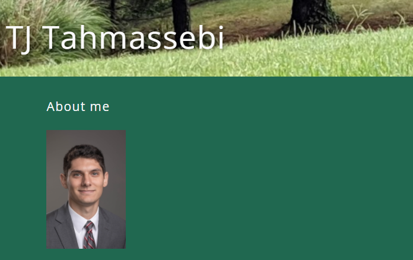

# React Portfolio

## Description

The React Portfolio is an online professional portfolio meant to showcase various project I have completed and highlight my skills in web development. It is a single-page application that utilizes React for the front-end. This portfolio contains an About Me page, links to my projects and professional media pages, as well as my resume and a contact page.

## Table of Contents 
- [Installation](#installation)
- [Usage](#usage)
- [Credits](#credits)
- [License](#license)

## Installation
To install the React Portfolio, first download the files from the Github repo,  open a terminal inside the appropriate folder, and run "npm install". To launch the React app, run "npm run build" and then "npm run start" to create the application. The app will give you the link to the localhost port. If you wish to insert your own data, navigate to the components foler inside the src folder and make changes to the HTML code inside each index as needed (you may need to switch out some files in the assets and public if you wish to use your own pictures). 

## Usage

To begin using the React Portfolio, first go to https://still-escarpment-66018.herokuapp.com/ . The landing page of the app is the About Me page. The Nav bar contains links to the other pages in the site, including the Project page, Resume page, and Contact page. There are buttons at the bottom of the page which contain links to my Github, LinkedIn, and Stack Overflow pages as well. On the Project page there are links to 5 of my projects and their repositories. The resume page contains a list of my skills, as well as a link to my most current resume. And finally, the contact page contains field to enter your name, email, and a message to reach out to me. 

## Credits
The Github repository resides at https://github.com/tjtahmas/React-Portfolio

You can contact me with any questions or comments about the project at tjtahmas@gmail.com

## License

MIT License

Copyright (c) 2021 Thomas Tahmassebi

Permission is hereby granted, free of charge, to any person obtaining a copy
of this software and associated documentation files (the "Software"), to deal
in the Software without restriction, including without limitation the rights
to use, copy, modify, merge, publish, distribute, sublicense, and/or sell
copies of the Software, and to permit persons to whom the Software is
furnished to do so, subject to the following conditions:

The above copyright notice and this permission notice shall be included in all
copies or substantial portions of the Software.

THE SOFTWARE IS PROVIDED "AS IS", WITHOUT WARRANTY OF ANY KIND, EXPRESS OR
IMPLIED, INCLUDING BUT NOT LIMITED TO THE WARRANTIES OF MERCHANTABILITY,
FITNESS FOR A PARTICULAR PURPOSE AND NONINFRINGEMENT. IN NO EVENT SHALL THE
AUTHORS OR COPYRIGHT HOLDERS BE LIABLE FOR ANY CLAIM, DAMAGES OR OTHER
LIABILITY, WHETHER IN AN ACTION OF CONTRACT, TORT OR OTHERWISE, ARISING FROM,
OUT OF OR IN CONNECTION WITH THE SOFTWARE OR THE USE OR OTHER DEALINGS IN THE
SOFTWARE.
---